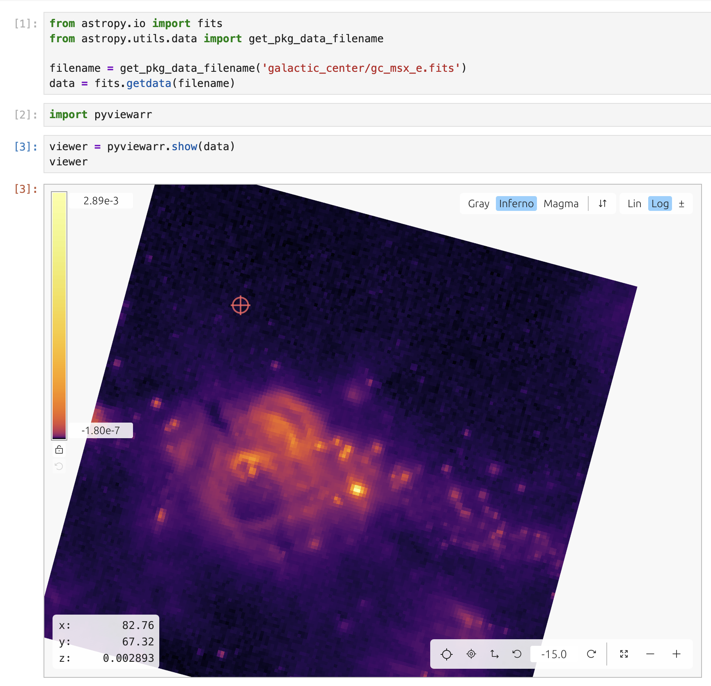
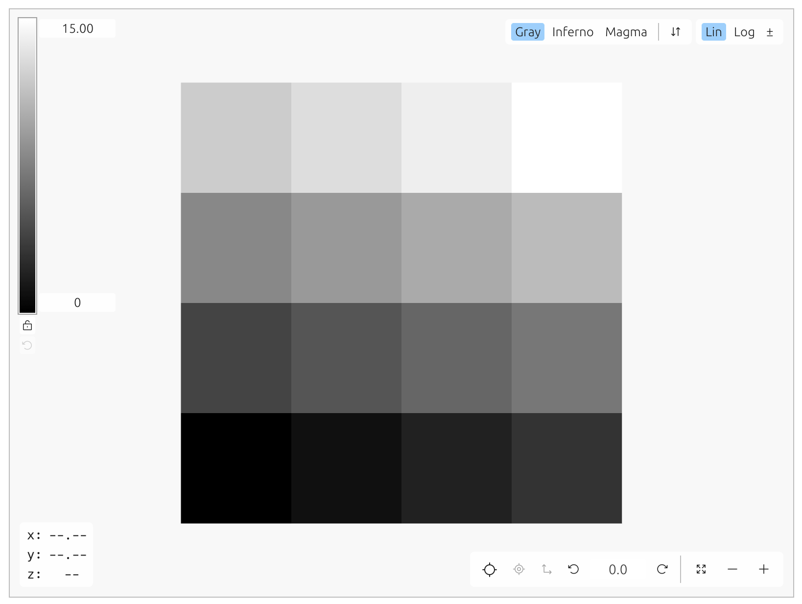
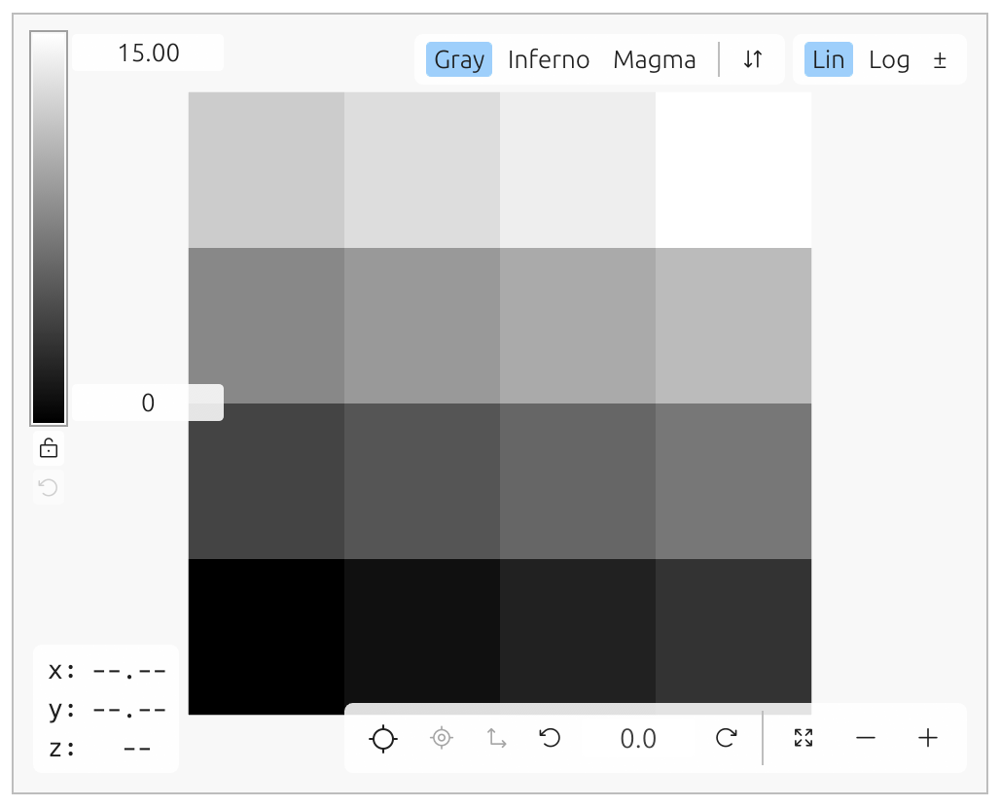
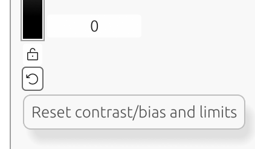

# pyviewarr

🤖 _**Clanker code disclaimer:** written (largely) with large language model coding tools. Use at your own risk._ 🤖

A faster, more intuitive way to explore 2D data (i.e. monochromatic images) in Python notebooks 




## Installation

```sh
pip install pyviewarr
```

or with [uv](https://github.com/astral-sh/uv):

```sh
uv add pyviewarr
```

## Usage

First, open a notebook interface like JupyterLab (or [another](https://anywidget.dev/en/community/) supporting anywidget).

### Basic

`pyviewarr.show()` returns a widget instance. If it's the last line of your cell, it will display automatically.

```python
import numpy as np

x = np.arange(16).reshape(4, 4)
pyviewarr.show(x)
```



Width and height of the widget can be set in the call to `show()`:

```python
pyviewarr.show(x, width=500, height=400)
```



You can also explicitly display with [`IPython.display.display()`](https://ipython.readthedocs.io/en/stable/api/generated/IPython.display.html#IPython.display.display):


```python
widget = pyviewarr.show(x)
from IPython.display import display
display(widget)
```

If there are more than two axes, the last two axes are treated as Y and X (NumPy convention) and navigation buttons are shown for any others.

Navigating in a large datacube remains responsive because only one slice/image is sent to the viewer at a time.

### Image stretching

Mapping array values to images for display involves normalization (stretching) which can include nonlinear transformations.

For all of these manipulations, you can reset them with the reset button:



#### Stretching

Right-clicking and dragging on the image viewer widget changes the contrast and bias. (If you have used ds9, this will feel familiar.)

#### Limits

When the image loads, the viewer sets the color limits to `min(image)` and `max(image)`. Type in new limits if you want.

If you want to avoid resetting the limits (e.g. when paging through a data cube) use the lock button to fix the limits at their current values.

#### Linear/Log

Only three colormaps are included: gray, inferno, and magma (from matplotlib). Log stretch behaves like ds9 as well, such that negative values are rescaled and don't make invalid pixel values.

#### Diverging (±)

When examining residuals, you may want a diverging colormap centered at zero. Use the ± button to switch the limits to symmetric and the available colormaps to RdBu and RdYlBu (from matplotlib).

### Zooming, panning, rotation

Zoom by clicking the +/- buttons at lower right, scrolling with your mouse/trackpad, or using the `-` and `=` keys. Reset zoom with the "reset zoom to fit" button or the `0` key.

Pan by clicking and dragging. Cmd/Ctrl-Click to center the pixel under the cursor.

Use the left and right arrow buttons to rotate in 15º increments, or enter a number in degrees (counter-clockwise) in the box between them.

By default, rotation is about the image center, but you can set a pivot point by Cmd/Ctrl-Shift-clicking the desired point.

Shift-clicking on the image calls an optional Python callback with continuous data-space coordinates (`x`, `y` including fractional pixel position).
Overlay help text is optional and only shown when you provide `overlay_message`.

### Matplotlib integration

Once you've rotated and panned and stretched and zoomed you may want to save a plot, but the viewer doesn't handle plotting.

Fortunately, the widget has a `plot_to_matplotlib()` method that takes a matplotlib.axes.Axes instance:

```python
fig, ax = plt.subplots()
widget.plot_to_matplotlib(ax)
```

**Note:** Rotating the axes makes the matplotlib tick labels useless, so they are hidden.

If you just want the contrast / bias / stretch, you can get a `norm` from the `get_normalization()` method:

```python
norm = widget.get_normalization()
import matplotlib.pyplot as plt
plt.imshow(x, norm=norm)
```

### Widget API

#### `ViewerConfig`

Using the `ViewerConfig` dataclass or passing its arguments to `show()` lets you set the initial configured state of the viewer.

```python
pyviewarr.show(x, vmin=-10, vmax=10)
```

See [example](./preconfigured_state_example.ipynb).
See also [shift-click callback demo](./notebooks/shift_click_callback_demo.ipynb).

You can register a callback and set an optional overlay hint:

```python
points = []

def mark_point(x, y):
    points.append((x, y))
    print(f"Marked at x={x:.3f}, y={y:.3f}")

cfg = pyviewarr.ViewerConfig(
    on_shift_click=mark_point,
    overlay_message="Shift-click to add a point"
)
widget = pyviewarr.show(x, viewer_config=cfg)
```

#### Setting data

If you retain a reference to the widget, you can set its contents from a later cell (if you want).

```python
widget = pyviewarr.show(x)
widget
```

Now you can change the live widget's contents by supplying a new array to `set_array()`.

```
new_arr = np.random.randn(512, 512).astype(np.float32) * 100
widget.set_array(new_arr)
```

## Development

Be sure to clone with `git clone --recurse-submodules` (or, if you cloned first and **then** read this, `git submodule update --init --recursive` to initialize an existing clone). 

The frontend part of the widget (i.e. `viewarr` itself) is written in Rust with egui, requiring a Rust compiler toolchain for `wasm32-unknown-unknown` and the [`wasm-pack`](https://drager.github.io/wasm-pack/installer/) tool installed.

Install rust with rustup: https://rustup.rs/

Now that you have `cargo`, install wasm-pack with `cargo install wasm-pack`.

Using [uv](https://github.com/astral-sh/uv) for development will automatically manage virtual environments and dependencies for you.

For live reloading in development:

```sh
export ANYWIDGET_HMR=1
```

Export this variable before starting JupyterLab so it will use hot module reloading.

```sh
uv run jupyter lab example.ipynb
```

Alternatively, create and manage your own virtual environment:

```sh
python -m venv .venv
source .venv/bin/activate
pip install -e ".[dev]"
```

The widget front-end code bundles it's JavaScript dependencies. After setting up Python,
make sure to install these dependencies locally:

```sh
npm install
```

While developing, you can run the following in a separate terminal to automatically
rebuild JavaScript as you make changes:

```sh
npm run dev
```

Open `example.ipynb` in JupyterLab, VS Code, or your favorite editor
to start developing. Changes made in `js/` will be reflected
in the notebook.

To do a full build, use the project script:

```sh
npm run build:all
```

### End-to-end tests (Galata + Playwright)

The widget has browser E2E tests using JupyterLab's Galata helpers.

First-time setup for browser binaries:

```sh
npm run test:e2e:install
```

Run E2E tests headless:

```sh
npm run test:e2e
```

Run E2E tests with a visible browser:

```sh
npm run test:e2e:headed
```

The test server uses `tests/e2e/jupyter_server_config.py`, which enables Galata's JupyterLab test hooks.

## Releasing

Note that `viewarr/` submodule changes will need to be committed and pushed first, then the submodule reference in this repository can be updated.

Release checklist:

1. Update changelog entries and set `[project].version` in `pyproject.toml` to the release version (e.g. `0.3.2`), then commit.
2. Create the Git tag/release for that version (e.g. `v0.3.2`).
3. Immediately after release, bump `pyproject.toml` to the next development version (e.g. `0.3.3dev`) and commit.

GitHub releases are automatically pushed to PyPI by the workflow in [`.github/workflows/ci.yml`](./.github/workflows/ci.yml).

## Changelog

### Unreleased (since `v0.3.2`)

#### pyviewarr changes

- Added `ViewerConfig.on_shift_click` Python callback to receive shift-click coordinates in data space (`x`, `y`) with fractional precision.
- Refactored overlay text to generic `ViewerConfig.overlay_message` (not callback-specific).
- Removed default overlay text; overlay is now hidden unless `overlay_message` is provided.
- Added tests covering shift-click callback wiring and `ViewerConfig` JS serialization exclusions for Python-only fields.
- Added a demonstration notebook: [`notebooks/shift_click_callback_demo.ipynb`](./notebooks/shift_click_callback_demo.ipynb).
- Updated notebook callback logging example to use `ipywidgets.Output` for reliable async callback output display.
- Updated usage docs with shift-click callback example and notebook link.
- Updated bundled `viewarr` submodule to include shift-click callback and overlay layout improvements.

#### Included `viewarr` changes

- Added shift-click callback events via `onClick(...)` with continuous (fractional) data-space coordinates.
- Added generic overlay message APIs: `getOverlayMessage(...)` and `setOverlayMessage(...)`.
- Added `overlayMessage` support to `setViewerState(...)`.
- Renamed overlay API from shift-click-specific names to generic names (`getOverlayMessage`/`setOverlayMessage`, `overlayMessage` in state config).
- Removed default overlay text; overlay only renders when message text is supplied.
- Updated overlay placement to compute a live safe area between bottom overlays, avoiding overlap with hover coordinates and zoom controls while keeping the message centered in that gap.

### `v0.3.2`

#### pyviewarr changes

- Updated bundled `viewarr` submodule from `3797ee7` to `cc78498`.

#### Included `viewarr` changes

- Fixed diverging/symmetric colorbar limit behavior so `vmax` is the only editable limit, coerced positive, and `vmin` is displayed as `-vmax` in that mode.
- Fixed state callback / `getValueRange()` limit reporting in diverging/symmetric mode to reflect the effective displayed range.

### `v0.3.1`

#### pyviewarr changes

- Added browser end-to-end testing with Playwright + JupyterLab Galata (`playwright.config.ts`, `tests/e2e/`).
- Added CI coverage for Playwright E2E tests in [`.github/workflows/ci.yml`](./.github/workflows/ci.yml).
- Expanded development documentation for build/test workflows.
- Updated bundled `viewarr` submodule from `3d74f69` to `3797ee7`.

#### Included `viewarr` changes

- Fixed Cmd/Ctrl-click centering coordinate mapping.
- Pinned wasm-bindgen stack to avoid `glow`/`js-sys` CI build breakages.
- Added/expanded viewer state APIs in JS/TS:
  - `setViewerState(...)` for partial bulk state updates.
  - `getZoom(...)` / `setZoom(...)`.
  - `setColormap(...)` / `setColormapReversed(...)`.
  - New `StretchMode` and `ViewerStateConfig` typings.
- Improved colormap name handling/parsing with canonical names and aliases (`gray`/`grayscale`/`greyscale`, etc.).
